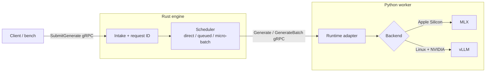

# Omnispan

Omnispan is a from-scratch **LLM inference serving and scheduling testbed**: a
small control plane in front of a real model runtime, built to make the core
tradeoffs of inference orchestration measurable rather than theoretical.

A client sends generation requests to a Rust engine; the engine applies a
scheduling policy (serialize, queue, or micro-batch) and dispatches to a Python
worker that runs a real model backend (MLX locally on Apple Silicon, vLLM on
Linux/NVIDIA GPUs). Every request is instrumented so you can see how a policy
change moves the numbers that matter: **TTFT, TPOT, throughput, and queue wait**.

## Why this exists

Inference serving is a stack of tradeoffs — batching improves throughput but
inflates tail latency; prefix caching helps only for structured prompts;
multi-tenant fairness fights raw utilization. Omnispan is a place to implement
those policies end to end and *measure* them under concurrent load, instead of
reasoning about them in the abstract. It is deliberately small so the control
plane is legible: you can read the scheduler loop, add a policy, and re-run the
benchmark in one sitting.

- `engine/`: Rust control plane — request intake, scheduling policies, worker RPC
- `worker/`: Python model worker with pluggable backends (MLX, vLLM)
- `proto/`: shared gRPC contract
- `bench/`: load generator, SLO auto-tuner, and result artifacts
- `docs/`: design and planning notes

## Architecture



The worker gRPC contract is identical across backends; the backend switch lives
entirely inside `worker/`.

## Scheduling policies

The engine implements three request-admission policies, selected with
`ENGINE_MODE`. Each one exists to isolate a specific tradeoff.

| Mode | Behavior | What it demonstrates |
|---|---|---|
| `direct` | Execute inline on the request thread, no queue | Baseline — and why unmanaged concurrency is unsafe (the MLX runtime segfaults under concurrent native calls) |
| `queued` | Single in-engine queue, one request executed at a time | Safe serialization; isolates queue-wait cost under concurrency |
| `micro_batch` | Accumulate requests for a short window, dispatch as one batch | Throughput gains from batching, and the latency/observability cost they carry |

## Inference metrics

Omnispan measures request execution as distinct phases rather than one latency
number, because that decomposition is what drives serving decisions:

- **TTFT (time to first token)** — prefill cost the user feels before anything
  appears. Measured inside the worker by streaming generation token-by-token.
- **TPOT (time per output token)** — mean inter-token latency during decode.
- **Queue wait** — time a request sits in the engine queue before dispatch.
- **Worker latency** — total time inside the worker (prefill + decode).
- **Throughput** — aggregate tokens/second across all successful requests.

In **streaming mode** (see [Streaming](#streaming)) TTFT is measured at three
vantage points on the same request, which localizes where latency actually comes
from:

- **worker TTFT** — model prefill time, measured at the runtime.
- **engine TTFT** — dispatch to first token forwarded onward (adds engine overhead).
- **client TTFT** — first token on the wire at the client; this is what the user
  feels, and under concurrency it also absorbs queue/serialization wait.

A large client-vs-engine gap points at queueing, not prefill — the kind of
distinction that changes whether you scale workers or tune the scheduler.

TPOT is captured both worker-side and client-side (`client_tpot_ms`). Unlike
TTFT, the two tend to match closely even under load: queue wait is paid *before*
the first token, so it inflates TTFT but not the steady-state decode rate. If
TPOT is healthy while TTFT is not, the bottleneck is admission/queueing, not the
model.

> **Measurement honesty:** TTFT and TPOT are serving metrics tied to a token
> stream the client actually receives. For MLX they are reported **only on the
> streaming path** — the unary and synchronous-batch paths return the whole
> response at once (batch via `mlx_lm.batch_generate` returns only final texts),
> so a first-token time there would describe an internal decode property, not a
> latency anyone observed. Those paths are judged by throughput and total
> latency. vLLM is different: its continuous batching streams each sequence
> independently, so per-request TTFT/TPOT stay valid even on its unary/batch
> paths, read from vLLM's native metrics.

## Prerequisites

- Rust toolchain
- `python`
- Python environment with backend-specific worker dependencies installed
- `grpcurl` for manual testing

Install local MLX worker dependencies:

```bash
python -m pip install -r worker/requirements.txt
```

Install vLLM worker dependencies on your Linux/CUDA box instead:

```bash
python -m pip install -r worker/requirements-vllm.txt
```

## Worker backends

- `WORKER_BACKEND=mlx`
  - default backend
  - intended for Apple Silicon local development
  - default model: `mlx-community/Qwen2.5-7B-Instruct-4bit`

- `WORKER_BACKEND=vllm`
  - intended for Linux + NVIDIA GPU environments such as RunPod
  - default model: `Qwen/Qwen2.5-7B-Instruct`
  - useful env vars: `MODEL_ID`, `VLLM_TENSOR_PARALLEL_SIZE`,
    `VLLM_GPU_MEMORY_UTILIZATION`, `VLLM_MAX_MODEL_LEN`, `VLLM_TRUST_REMOTE_CODE`,
    `VLLM_ENFORCE_EAGER`, `VLLM_ENABLE_PREFIX_CACHING`, `WORKER_DEBUG_BATCH_LOGGING`,
    `VLLM_DTYPE`, `VLLM_QUANTIZATION` (see [Configuration](#configuration))

## Run

Start the local MLX worker:

```bash
python worker/worker.py
```

Start a vLLM worker on RunPod/Linux:

```bash
WORKER_BACKEND=vllm \
MODEL_ID=Qwen/Qwen2.5-7B-Instruct \
VLLM_GPU_MEMORY_UTILIZATION=0.9 \
python worker/worker.py
```

Example for an AWQ model on a single NVIDIA GPU:

```bash
WORKER_BACKEND=vllm \
MODEL_ID=Qwen/Qwen3-32B-AWQ \
VLLM_QUANTIZATION=AWQ \
VLLM_GPU_MEMORY_UTILIZATION=0.85 \
VLLM_MAX_MODEL_LEN=4096 \
VLLM_ENFORCE_EAGER=1 \
VLLM_ENABLE_PREFIX_CACHING=1 \
python worker/worker.py
```

Start the engine in a second terminal (use `queued` for any concurrent test):

```bash
cd engine
ENGINE_MODE=queued WORKER_ENDPOINT=http://127.0.0.1:50071 cargo run --bin omnispan-engine
```

Run micro-batch mode:

```bash
cd engine
ENGINE_MODE=micro_batch WORKER_ENDPOINT=http://127.0.0.1:50071 BATCH_WINDOW_MS=20 MAX_BATCH_SIZE=4 cargo run --bin omnispan-engine
```

Submit a request with `grpcurl` from the repo root:

```bash
grpcurl -plaintext -import-path ./proto -proto omnispan.proto \
  -d '{"tenant_id":"shared-basic","prompt":"Explain transformer attention in 3 sentences.","max_tokens":150}' \
  127.0.0.1:50061 omnispan.Engine/SubmitGenerate
```

Fetch engine stats:

```bash
grpcurl -plaintext -import-path ./proto -proto omnispan.proto \
  -d '{}' \
  127.0.0.1:50061 omnispan.Engine/GetEngineStats
```

## Configuration

### Serving engine environment variables

| Variable | Description | Default |
|---|---|---|
| `ENGINE_MODE` | Serving mode: `direct` (debug-only), `queued`, or `micro_batch` | `direct` |
| `BIND_HOST` | Host address to bind the engine server | `127.0.0.1` |
| `BIND_PORT` | Port number to bind the engine server | `50061` |
| `WORKER_ENDPOINT` | The endpoint of the model worker process | `http://127.0.0.1:50071` |
| `WORKER_RPC_TIMEOUT_MS` | Timeout for gRPC calls to the worker (in ms) | `30000` |
| `QUEUE_CAPACITY` | Capacity of the request scheduler queue | `1024` |
| `BATCH_WINDOW_MS` | Waiting window to accumulate requests in `micro_batch` mode (in ms) | `10` |
| `MAX_BATCH_SIZE` | Maximum number of requests grouped in a batch in `micro_batch` mode | `4` |

### Model worker environment variables

| Variable | Description | Default |
|---|---|---|
| `WORKER_BACKEND` | Backend model runtime: `mlx` (local Apple Silicon) or `vllm` (Linux GPU) | `mlx` |
| `WORKER_HOST` | Host address to bind the worker server | `127.0.0.1` |
| `WORKER_PORT` | Port number to bind the worker server | `50071` |
| `MODEL_ID` | Model identifier or path (HuggingFace) | Backend dependent (see below) |

#### MLX backend
- `MODEL_ID` defaults to `mlx-community/Qwen2.5-7B-Instruct-4bit`.

#### vLLM backend
- `MODEL_ID` defaults to `Qwen/Qwen2.5-7B-Instruct`.
- `VLLM_TENSOR_PARALLEL_SIZE`: Number of GPUs to partition the model across. Default: `1`.
- `VLLM_GPU_MEMORY_UTILIZATION`: Target GPU memory fraction. Default: `0.9`.
- `VLLM_MAX_MODEL_LEN`: Cap on the model context length.
- `VLLM_TRUST_REMOTE_CODE`: Set `1` or `true` to trust HuggingFace model code. Default: `false`.
- `VLLM_ENFORCE_EAGER`: Set `1` or `true` to disable CUDA graph capture. Default: `false`.
- `VLLM_ENABLE_PREFIX_CACHING`: Set `1` or `true` to turn on automatic prefix caching. Default: `false`.
- `VLLM_DTYPE`: Data type of weights (e.g. `half`, `float16`, `bfloat16`).
- `VLLM_QUANTIZATION`: Quantization type (e.g. `awq`, `gptq`, `squeezellm`).
- `VLLM_ASYNC`: Set `1` or `true` to use the `AsyncLLMEngine` runtime, which adds streaming (per-request tokens with real TTFT/TPOT) on top of vLLM's continuous batching. Default: `false` (synchronous `LLM`, no streaming). Requires GPU — validated on RunPod.
- `WORKER_DEBUG_BATCH_LOGGING`: Set `1` or `true` to enable verbose batch logging in worker (synchronous path only). Default: `false`.

## Benchmarking

[`bench/benchmark.py`](bench/benchmark.py) runs a concurrent load test against a
running engine and prints a JSON summary including TTFT and TPOT percentiles.

```bash
python bench/benchmark.py \
  --target 127.0.0.1:50061 \
  --requests 10 \
  --concurrency 10 \
  --max-tokens 150 \
  --mode queued
```

Options:

- `--target`: gRPC endpoint of the engine (default: `127.0.0.1:50061`).
- `--requests` / `--concurrency`: total requests and max in-flight (default: `10` / `10`).
- `--tenant-prefix` / `--tenant-count`: mock multiple tenants (default: `tenant` / `2`).
- `--max-tokens`: `max_tokens` per request (default: `150`).
- `--shared-prefix-repeats` / `--suffix-template`: build a prefix-cache-sensitive workload.
- `--mode`: label for the output JSON.

Save results to a JSON artifact:

```bash
python bench/benchmark.py --requests 10 --concurrency 10 --mode micro_batch_w10_b4 > bench/micro_batch_w10_b4.json
```

## Streaming

The engine exposes a server-streaming RPC, `SubmitGenerateStream`, that emits one
chunk per output token followed by a terminal summary chunk. This is what makes
**client-observed TTFT** a real measurement rather than a value reported after the
fact. Streaming is supported in `direct` and `queued` modes; in `micro_batch`
mode it returns `UNIMPLEMENTED` (per-request streaming out of a shared batch
requires token-level continuous batching — see the roadmap).

**Queueing.** Streaming does not flow through the unary scheduler loop (a stream
produces tokens over time and cannot fit its dispatch-then-await shape). Instead,
`queued` mode serializes streams with a dedicated 1-permit **stream gate**,
preserving one-request-at-a-time worker access — required because MLX segfaults on
concurrent native calls. Waiting streams count toward `queue_depth`, and the wait
is reported as `gate_wait_ms` on the final chunk (surfaced as `queue_wait_ms` in
the benchmark) so it is not left hiding inside client TTFT. In `direct` mode there
is no gate and no serialization. If a client disconnects mid-stream, the engine
stops draining the worker so the decode can be abandoned instead of producing
tokens nobody will read.

**Backend support.** MLX streams via `mlx_lm.stream_generate` (validated locally).
The vLLM path streams via `AsyncLLMEngine` (`WORKER_BACKEND=vllm VLLM_ASYNC=1`),
where a single engine serves streaming, unary, and batch requests and vLLM
continuously batches them at the token level — so per-request TTFT/TPOT stay
valid even under concurrency, and a client disconnect calls `engine.abort()` to
free the decode. The vLLM async runtime requires GPU and is validated on RunPod;
the default synchronous vLLM runtime does not stream.

Drive it from the benchmark with `--stream`:

```bash
python bench/benchmark.py --requests 8 --concurrency 4 --max-tokens 64 --mode queued_stream --stream
```

The summary then includes `client_ttft_ms` and `engine_ttft_ms` blocks alongside
the worker-reported `ttft_ms`, so the three layers can be compared directly.

Stream a single request with `grpcurl`:

```bash
grpcurl -plaintext -import-path ./proto -proto omnispan.proto \
  -d '{"tenant_id":"shared-basic","prompt":"Explain transformer attention in 3 sentences.","max_tokens":64}' \
  127.0.0.1:50061 omnispan.Engine/SubmitGenerateStream
```

## Backend capability matrix

Rows are engine scheduling policies (`ENGINE_MODE`); columns are the two request
modes. `SubmitGenerateStream` in `micro_batch` returns `UNIMPLEMENTED` at the
engine for both backends (per-request streaming out of a shared batch needs
token-level continuous batching).

### MLX (Apple Silicon)

| Policy | Non-streaming (`SubmitGenerate`) | Streaming (`SubmitGenerateStream`) |
|---|---|---|
| `direct` | ⚠️ debug only — **unsafe under concurrency** (concurrent native calls segfault) | ⚠️ debug only — single request streams (client/engine/worker TTFT + TPOT); concurrency still unsafe |
| `queued` | ✅ safe, serialized; judged by throughput + latency | ✅ safe, serialized by a 1-permit stream gate; full TTFT/TPOT decomposition |
| `micro_batch` | ✅ static batch (`batch_generate`), best throughput | ❌ `UNIMPLEMENTED` — static batch can't stream per request; MLX has no continuous batching |

For MLX, **TTFT/TPOT are reported only on the streaming column**. The unary path
returns the whole response at once, so a first-token time would describe an
internal decode property rather than a latency the client observes; the unary
path is judged by throughput and total latency. (vLLM's unary path still reports
TTFT/TPOT from vLLM's own per-request metrics — see below.)

### vLLM (Linux + NVIDIA GPU)

Non-streaming uses the synchronous `LLM` (default). Streaming uses the
`AsyncLLMEngine` runtime (`VLLM_ASYNC=1`), which is GPU-only and RunPod-pending.

| Policy | Non-streaming (sync `LLM`, default) | Streaming (`VLLM_ASYNC=1`, async engine) |
|---|---|---|
| `direct` | ⚠️ single request; the sync `LLM` is not built for concurrent calls | ✅ **ideal** — concurrent streams all reach vLLM's continuous batcher; per-request TTFT/TPOT stay valid |
| `queued` | ✅ serialized; the safe way to drive the sync `LLM` under load | ✅ works, but the stream gate serializes and **underuses** vLLM's batcher |
| `micro_batch` | ✅ explicit batch; TTFT/TPOT valid (vLLM's native metrics), but **partly redundant** with vLLM's own batching | ❌ `UNIMPLEMENTED` (engine-level) |

**Reading the matrices — the backends invert.** MLX has no internal scheduler, so
it *relies on the engine* to impose order: `direct` under concurrency segfaults,
and throughput comes from the engine's `micro_batch`. vLLM brings its own
continuous batching, so it wants the engine to *get out of the way*: the async
engine is happiest with `direct` + concurrency (requests flow straight into
vLLM's batcher), while engine-level `queued`/`micro_batch` become redundant or
counterproductive. This contrast is much of why production stacks fold
scheduling and batching into the runtime (vLLM/SGLang) rather than an outer
control plane.

## SLO-driven auto-tuning

[`bench/autotune.py`](bench/autotune.py) sweeps a grid of engine scheduling
configurations, drives a short load test against each, and recommends the config
that **maximizes throughput while meeting a latency SLO**. It owns the engine
lifecycle (launch with the right env → wait until serving → load → tear down);
the worker is assumed to already be running.

Throughput / client-latency SLO (unary load, sweeps all configs):

```bash
python bench/autotune.py \
  --engine-bin engine/target/debug/omnispan-engine \
  --worker-endpoint http://127.0.0.1:50071 \
  --requests 12 --concurrency 6 --max-tokens 64 \
  --windows 5,10,20 --batch-sizes 1,2,4 \
  --slo-client-p95-ms 8000
```

TTFT/TPOT SLO — add `--stream` (those metrics only exist on the streaming path
for MLX). Configs that cannot stream (`micro_batch`) are skipped, so on MLX this
effectively evaluates the stream-capable `queued` config:

```bash
python bench/autotune.py --worker-endpoint http://127.0.0.1:50071 \
  --requests 12 --concurrency 6 --max-tokens 64 --batch-sizes 1,4 \
  --stream --slo-ttft-p95-ms 1500 --slo-tpot-p95-ms 40
```

If an SLO targets a metric a config cannot measure (a TTFT/TPOT SLO under
`micro_batch`, or without `--stream` on MLX), the tuner records an SLO violation
rather than passing the config on an unmeasured metric — so it never recommends a
config on the strength of a number it did not actually capture. This also
surfaces a real MLX limitation: the configs that give throughput (batching)
cannot stream, and the config that streams (`queued`) does not batch — you cannot
have both without continuous batching.

## Benchmark results

### 1. Local MLX performance (Apple Silicon)
*Model: `mlx-community/Qwen2.5-7B-Instruct-4bit` | Concurrency: 10 | Requests: 10 | Max Tokens: 150. Artifacts: [`bench/`](bench/) (`queued.json`, `micro_batch_w*_b*.json`).*

| Serving Configuration | Success | Wall Clock | Throughput | Worker Latency (p50) | Queue Wait (p50) | Client Latency (p50) |
|---|---|---|---|---|---|---|
| **Queued** | 10/10 | 22.75s | 71.65 tokens/s | 2,248 ms | 10,337 ms | 12,640 ms |
| **Micro-Batch (w10/b2)** | 10/10 | 14.73s | 110.68 tokens/s | 2,921 ms | 5,895 ms | 8,858 ms |
| **Micro-Batch (w10/b4)** | 10/10 | 14.21s | 114.73 tokens/s | 5,484 ms | 5,511 ms | 11,107 ms |
| **Micro-Batch (w10/b8)** | 10/10 | 14.73s | 110.69 tokens/s | 11,723 ms | 12 ms | 11,745 ms |
| **Micro-Batch (w20/b4)** | 10/10 | 13.91s | **117.22 tokens/s** | 5,426 ms | 5,511 ms | 10,946 ms |

- **`direct` is unsafe under concurrency:** one request is fine (c=1 baseline: 67.9 tokens/s, 2,306 ms), but concurrent `direct` invocation segfaults the MLX runtime, so it is not run at c=10.
- **Queued serializes:** safe and stable, but queue wait dominates (~10.3s p50) under concurrency.
- **Micro-batch ≈1.6× throughput:** batching lifts throughput to ~117 tokens/s (w20/b4) and cuts client latency vs queued. Batch 8 pushes worker latency to ~11.7s (the whole batch decodes together) for no gain over batch 4.

### 2. Streaming TTFT / TPOT decomposition (MLX, queued)
*Model: `mlx-community/Qwen2.5-7B-Instruct-4bit` | Concurrency: 8 | Requests: 8 | Max Tokens: 150 | streaming. Artifact: [`bench/queued_stream.json`](bench/queued_stream.json).*

| Vantage point | TTFT (p50) | TTFT (p95) | TPOT (p50) | TPOT (p95) |
|---|---|---|---|---|
| **Worker** (model prefill / decode) | 208 ms | 298 ms | 13.8 ms | 14.4 ms |
| **Engine** (dispatch → first forward) | 211 ms | 301 ms | — | — |
| **Client** (on the wire) | 8,391 ms | 15,596 ms | 13.9 ms | 14.5 ms |
| *of which: gate wait* (`queue_wait_ms`) | *8,174 ms* | *15,388 ms* | — | — |

- **The latency budget closes:** client TTFT ≈ gate wait + engine TTFT (8,391 ≈ 8,174 + 211). At concurrency 8 with a single worker, **97% of the first-token latency is queueing**, not the model.
- **Queueing lives in TTFT, not TPOT:** client TPOT (13.9 ms) ≈ worker TPOT (13.8 ms) — once a request is streaming, tokens flow at the decode rate regardless of load. If TPOT is healthy but TTFT is not, the bottleneck is admission/queueing, not the model.
- **Engine overhead is negligible:** engine TTFT tracks worker TTFT within ~3 ms; the time is in the model and the queue, not the control plane.
- TTFT/TPOT come from the streaming path; the unary and `micro_batch` paths are judged by throughput and total latency (table 1).

### 3. RunPod A40 performance (vLLM, Automatic Prefix Caching)
*Model: `Qwen/Qwen3-32B-AWQ` | Concurrency: 2 | Requests: 2 | Max Tokens: 64 | Prefix-cache workload (6× repeated policy prefix)*

| Configuration | Wall Clock | Throughput | Worker Latency (p50) | Queue Wait (p50) | Throughput Gain |
|---|---|---|---|---|---|
| **Prefix Caching OFF** | 4.21s | 379.66 tokens/s | 4,149 ms | 11 ms | Baseline |
| **Prefix Caching ON** | 2.87s | **556.71 tokens/s** | **2,820 ms** | 10 ms | **1.47×** |

- **Prefix-cache savings:** vLLM's automatic prefix reuse saves substantial prefill time for prompts with shared prefixes.
- **Worker-side speedup:** queue wait stayed constant (~10–11 ms), confirming the gain is on the worker runtime, not the engine.
- The vLLM path also emits per-request TTFT/TPOT (read from vLLM's native request metrics); those columns will be captured on the next RunPod run.

## Scope and limitations

Omnispan is a **single-node testbed**, and its claims are bounded accordingly:

- One engine, one worker, one GPU/accelerator — no distributed scheduling, no multi-node parallelism.
- Backends cover **NVIDIA (vLLM)** and **Apple Silicon (MLX)** only; no AMD/ROCm.
- TTFT is measured on the streaming path; under batching it is derived/unmeasured as noted above.
- Benchmark samples here are small-N and meant to show tradeoff *shape*, not publishable percentiles.

Cluster-scale concerns (multi-scheduler K8s architectures, topology-aware
placement, fractional GPU allocation, checkpoint/restore, workload isolation)
are intentionally out of scope for the running code and are captured as design
notes instead.

## Design notes and roadmap

See [`docs/`](docs/) for design and planning notes. Planned next steps, roughly
in priority order:

- Prefix-aware / cache-affinity routing (group requests by shared prefix)
- Multi-tenant weighted-fair-queue scheduling with per-tenant fairness metrics
- SGLang worker backend behind the existing runtime interface
- Disaggregated prefill/decode workers with KV handoff (the "prefill leader / decode worker / KV router" pattern)
- Streaming under `micro_batch` via token-level continuous batching (the reason engines like vLLM exist)

End-to-end response streaming (`SubmitGenerateStream`) is implemented for
`direct` and `queued` modes, with client/engine/worker TTFT decomposition. The
MLX path is validated locally; the vLLM `AsyncLLMEngine` streaming path
(`VLLM_ASYNC=1`) is implemented and pending validation on RunPod GPU hardware.

## Regenerate Python gRPC stubs

If `proto/omnispan.proto` changes:

```bash
python -m grpc_tools.protoc \
  -I proto \
  --python_out=worker/generated \
  --grpc_python_out=worker/generated \
  proto/omnispan.proto
```

The Rust stubs regenerate automatically via `engine/build.rs` on `cargo build`.

## Notes

- The worker must run in a Python environment with the selected backend's dependencies installed.
- The engine auto-generates a request ID if the client omits one.
- Treat `direct` mode as debug-only; concurrent direct mode has triggered Python worker segmentation faults in the MLX runtime.
- `BATCH_WINDOW_MS` controls how long the engine waits to gather requests in `micro_batch` mode; `MAX_BATCH_SIZE` caps how many are grouped into one worker batch.
- The worker gRPC contract is unchanged across backends; the backend switch is entirely inside `worker/`.
- Worker startup fails loudly if `WORKER_HOST:WORKER_PORT` is already occupied, which helps catch stale worker processes instead of silently hitting the wrong instance.
- Benchmark artifacts are saved in [`bench/`](bench/) and [`bench/runpod/`](bench/runpod/).
